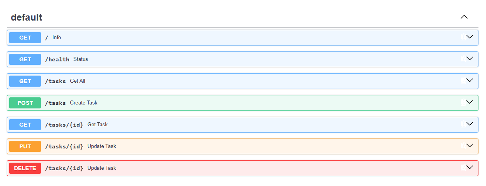
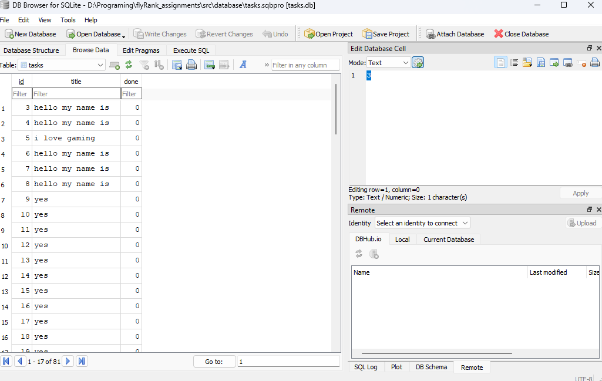
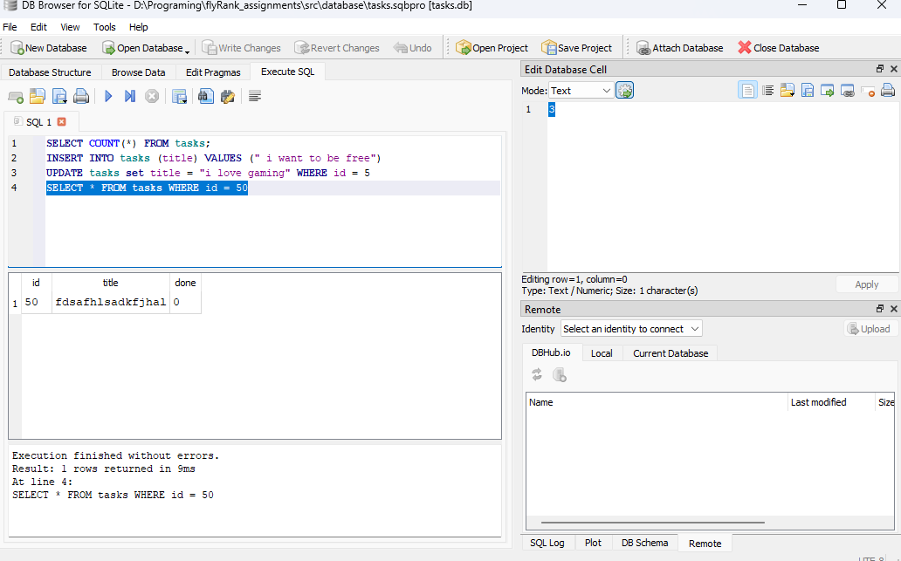

# FlyRank Week 2 Assignment

A small task management REST API built with FastAPI. The API keeps tasks in memory and supports creating, reading, updating, and deleting tasks. Because there is no database, all changes are lost when the application stops.

## Features

- List all tasks
- Get a task by its ID
- Create a task with a title
- Update a task title and/or completion status
- Delete a task
- Health-check endpoint
- Interactive Swagger UI documentation

## Requirements

- Python 3.10 or newer

## Installation

Open PowerShell in the project directory and install the dependencies:

```powershell
py -m pip install fastapi uvicorn
```

## Run the API

Start the development server from the project root:

```powershell
py -m uvicorn src.main:app --reload
```

The API will be available at:

- Base URL: http://127.0.0.1:8000
- Swagger UI: http://127.0.0.1:8000/docs
- ReDoc: http://127.0.0.1:8000/redoc

## Endpoints

| Method | Endpoint | Description |
| --- | --- | --- |
| GET | `/` | Returns API information |
| GET | `/health` | Returns the service health status |
| GET | `/tasks` | Returns all tasks |
| GET | `/tasks/{id}` | Returns one task |
| POST | `/tasks` | Creates a task from a title |
| PUT | `/tasks/{id}` | Updates a task title and/or status |
| DELETE | `/tasks/{id}` | Deletes a task |

## Using Swagger UI

1. Start the API with the command above.
2. Open [Swagger UI](http://127.0.0.1:8000/docs) in a browser.
3. Expand an endpoint and select **Try it out**.
4. Enter any required request data, then select **Execute**.

### Example request body

```json
{
  "title": "Complete the assignment"
}
```

## Project structure

```text
src/
└── main.py    # FastAPI application and task endpoints
```

## Swagger UI screenshot




# FlyRank Week 3 Assignment

This week adds persistent storage to the API using SQLite, via the new `database.py` module. Tasks are now saved to disk instead of living only in memory, so data survives an application restart.

## Why SQLite was chosen

- **Zero setup** — SQLite ships with Python's standard library (`sqlite3`), so there is no separate database server to install, configure, or run.
- **File-based** — the entire database lives in a single `.db` file, which makes it easy to inspect, back up, move, or reset during development.
- **Good fit for the assignment's scale** — this project is a small, single-user task API. SQLite handles that scope well without the operational overhead of a client-server database like PostgreSQL or MySQL.
- **Simple concurrency model** — since the app runs locally with one process, SQLite's file-locking approach is more than sufficient.

## Where the database file is stored

The database path is not hardcoded. It's read from the `DATABASE_LOCATION` environment variable, loaded via `python-dotenv` in `database.py`:

```python
load_dotenv()
db_location = os.getenv("DATABASE_LOCATION")
```

`DATABASE_LOCATION` should be set to an **absolute path** on your machine (e.g. `C:\Users\you\projects\flyrank\tasks.db`). If the file doesn't already exist at that path, `create_database()` creates it automatically and sets up the `tasks` table.

### Setting up your `.env` file

An `.env.example` file is included as a template. Copy it to `.env` and fill in the absolute path where you want the database file to live:

```powershell
copy .env.example .env
```

Then open `.env` and set the path:

```
DATABASE_LOCATION=C:\absolute\path\to\your\project\tasks.db
```

> `.env` is machine-specific (it holds an absolute path), so it should stay out of version control — add it to `.gitignore` if it isn't already.

## How to start the project

1. Install the dependencies:

   ```powershell
   py -m pip install fastapi uvicorn python-dotenv
   ```

2. Copy `.env.example` to `.env` and set `DATABASE_LOCATION` as described above.

3. Start the development server from the project root:

   ```powershell
   py -m uvicorn src.main:app --reload
   ```

4. The API will be available at:

   - Base URL: http://127.0.0.1:8000
   - Swagger UI: http://127.0.0.1:8000/docs

On first run, `database.py` will create the SQLite file at `DATABASE_LOCATION` and set up the `tasks` table if it doesn't exist yet.

## Database viewer screenshot




## Example SQL query

Query used to check for outstanding (not-done) tasks in the `tasks` table:

```sql
SELECT * FROM tasks WHERE done = 0;
```
